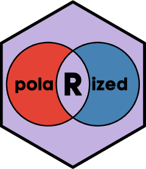

<!-- README.md is generated from README.Rmd. Please edit that file -->

# polaRized 

## Overview

This package makes it easy to apply various measures of attitude
polarization to large numbers of ordered ratings scales in complex
survey data. The two main functions are `polarize_assoc` and
`polarize_distr`, which return key associational and distributional
statistics, respectively. The package also introduces some extensions to
the `survey` package, enabling the incorporation of complex design
features into the estimation of statistics commonly used to measure
attitude polarization:

- `svykurt` calculates kurtosis.
- `svyskew` calculates standardized skewness.
- `svyextremism` calculates the proportion of extreme responses on
  ordered ratings scales with different lengths.

Additionally, two helper functions make it easier to prepare data prior
to calculating polarization: `filter_scale_length` returns ordered
ratings scales that meet a minimum threshold of unique values, which is
useful for statistics that require a certain scale length;
`spread_pairs` takes a name-value key and spreads these columns across
unique pairs of observations, making it easier to estimate the
association between responses on different survey items.

## Installation

The package can be installed directly from
[GitHub](https://github.com/dcaldwellphd/polaRized).

``` r
pak::pak("dcaldwellphd/polaRized")

library(polaRized)
```

## Data prerequisites

Apart from the `svykurt`, `svyskew`, and `svyextremism`, which are
general extensions to the `survey` package and designed to be called
like any other function from that package, `polaRized` expects data to
be stacked in a longer format. There should be a single value column or
(for associational measures of polarization) pair of value columns
containing observations across groups. The built-in data set (`toydata`)
comes in this format.

``` r
library(polaRized)

data(toydata)
head(toydata)
#> # A tibble: 6 × 7
#>      id group party_cat party_ord att_name  att_val weight
#>   <dbl> <chr> <chr>         <dbl> <chr>       <dbl>  <dbl>
#> 1     1 them  left              6 att2val        NA   1.86
#> 2     1 them  left              6 att4val         1   1.86
#> 3     1 them  left              6 att5val         2   1.86
#> 4     1 them  left              6 att10val        7   1.86
#> 5     1 them  left              6 att11val        8   1.86
#> 6     1 them  left              6 att100val      55   1.86
```

It has $n \times p$ rows recording the $nth$ respondent’s rating on
attitude item $p$. These values are stored in the name-value pair,
`att_name` and `att_val`. The two main functions in `polaRized` are
designed to iterate over the `att_name` column, calculating statistics
related to polarization using values in the `att_val` column.

## Describing attitude polarization using the `polaRized` package

There are two common approaches to measuring attitude polarization in
public opinion research: distributional and associational. These are the
unifying themes of the main functions implemented in this package:
`polarize_distr` and `polarize_assoc`.

### Distributional measures and `polarize_distr`

Many studies summarize polarization through aspects of the distribution
of public opinion surrounding political issues, such as the dispersion,
multimodality, and extremism in attitudes (e.g., Adams, Green, and
Milazzo 2012; DiMaggio, Evans, and Bryson 1996; Cohen and Cohen 2021).
The `polarize_distr` function provides many options for calculating
these quantities, including the variance, standard deviation,
interquartile range, kurtosis, and the proportion of extreme responses
on ordered ratings scales. It can also return other statistics that do
not directly measure distributional states of polarization but are
useful for interpreting changes in these states, i.e., the mean, median,
and skewness. Finally, the function also accepts methods for estimating
consensus and disagreement on ordered rating scales from the the `agrmt`
package, like van der Eijk’s (2001) agreement A.

Many of these statistics are sensitive to scale length or only make
sense when a scale has so many unique values. The variance and standard
deviation depend on the central tendency of a distribution, which is
problematic for very short scales where values are likely to be
clustered at one extreme. In some cases, the `polarize_distr` function
fails when provided scales below a certain length. For instance, the
`svyextremism` function from this package will not accept attitude items
with fewer than four unique values, whereas van der Eijk’s agreement A
defines polarization by disaggregating response frequencies into
“triples” deviating from or conforming to unimodality.[^1] To help meet
these requirements, `polaRized` includes a helper function designed to
filter out attitude scales below a user-defined threshold:
`filter_scale_length`. The default is to subset items with four or more
unique values.

``` r
length(unique(toydata$att_name))
#> [1] 7

# Remove the binary att2val variable from toydata
filtered_data <- filter_scale_length(
  toydata, 
  scale_names = att_name, 
  scale_values = att_val, 
  min_scale_length = 4
  )

length(unique(filtered_data$att_name))
#> [1] 6
```

Then it is safe to request any distributional measure from the
`polarize_distr` function. Hence, to get the standard deviation in
attitudes by item:

``` r
polarize_distr(
  filtered_data,
  value = att_val,
  measure = "std",
  by = "att_name"
  )
#> # A tibble: 6 × 2
#> # Rowwise:  att_name
#>   att_name  att_val_std
#>   <chr>           <dbl>
#> 1 att100val       29.0 
#> 2 att101val       29.4 
#> 3 att10val         2.90
#> 4 att11val         3.11
#> 5 att4val          1.09
#> 6 att5val          1.42
```

The resulting output shows that the standard deviation is larger among
longer ratings scales. If the goal is to compare the magnitude of these
statistics across items with heterogeneous scale lengths, we can
normalize on the fly using the `rescale_0_1` argument.

``` r
polarize_distr(
  filtered_data,
  value = att_val,
  measure = "std",
  by = "att_name",
  rescale_0_1 = TRUE
  )
#> # A tibble: 6 × 2
#> # Rowwise:  att_name
#>   att_name  att_val_std
#>   <chr>           <dbl>
#> 1 att100val       0.292
#> 2 att101val       0.294
#> 3 att10val        0.322
#> 4 att11val        0.311
#> 5 att4val         0.364
#> 6 att5val         0.356
```

The `by` argument accepts multiple grouping variables, which is useful
for comparing polarization in different populations:

``` r
polarize_distr(
  filtered_data,
  value = att_val,
  measure = "std",
  by = c("att_name", "group"),
  rescale_0_1 = TRUE
  )
#> # A tibble: 12 × 3
#> # Rowwise:  att_name, group
#>    att_name  group att_val_std
#>    <chr>     <chr>       <dbl>
#>  1 att100val them        0.289
#>  2 att100val us          0.297
#>  3 att101val them        0.295
#>  4 att101val us          0.293
#>  5 att10val  them        0.322
#>  6 att10val  us          0.323
#>  7 att11val  them        0.313
#>  8 att11val  us          0.310
#>  9 att4val   them        0.364
#> 10 att4val   us          0.363
#> 11 att5val   them        0.357
#> 12 att5val   us          0.354
```

Leaving it `NULL` smooths across any grouping information contained in
the data, resulting in a single value.

``` r
polarize_distr(
  filtered_data,
  value = att_val,
  measure = "std",
  rescale_0_1 = TRUE
  )
#> # A tibble: 1 × 1
#> # Rowwise: 
#>   att_val_std
#>         <dbl>
#> 1       0.281
```

### Associational measures and `polarize_assoc`

Distributional properties of polarization are intuitive, but much
discussion of mass disagreement on political issues centers on
associational measures (e.g., Baldassarri and Gelman 2008). For
instance, partisan polarization on a political issue is the extent to
which attitudes towards that issue are associated with partisanship. It
is thus common to measure it using the Pearson correlation coefficient,
especially in two-party cases such as the United States (Fiorina and
Abrams 2008). The built-in data for this package includes an ordinal
party variable similar to the scale used to measure the strength of
party identification in the US.

``` r
unique(toydata$party_ord)
#> [1]  6  4  1 NA  2  5  7  3
```

We can use the `polarize_assoc` function to get the Pearson correlation
between this variable and attitudes on the different scales, setting the
`r_or_r2` argument to “r”.

``` r
ap_r <- polarize_assoc(
  toydata,
  value_1 = att_val,
  value_2 = party_ord,
  r_or_r2 = "r",
  by = "att_name"
  )

ap_r
#> # A tibble: 7 × 2
#> # Rowwise:  att_name
#>   att_name         r
#>   <chr>        <dbl>
#> 1 att100val  0.00567
#> 2 att101val  0.0297 
#> 3 att10val   0.0114 
#> 4 att11val  -0.0442 
#> 5 att2val   -0.0155 
#> 6 att4val    0.00783
#> 7 att5val   -0.00154
```

Many other countries have more than two large political parties, which
are not necessarily ordered on a single dimension. This makes it
difficult to measure partisan polarization without assuming that
political disagreement operates along a left-right ideological
continuum. However, Caldwell, Cohen, and Vivyan (2023) introduce a novel
extension to associational measures of polarization that does not
require this assumption. The $R^2$ from a linear regression model is the
square of the correlation between observed and predicted outcomes. Given
an OLS model predicting attitudes towards an issue from partisanship, it
thus measures the extent to which different partisans hold different
positions on that issue.

This approach to measuring polarization is implemented by setting the
`r_or_r2` argument to “r2” in the `polarize_assoc` function.

``` r
ap_r2 <- polarize_assoc(
  toydata,
  value_1 = att_val,
  value_2 = party_ord,
  r_or_r2 = "r2",
  by = "att_name"
  )

ap_r2
#> # A tibble: 7 × 3
#> # Rowwise:  att_name
#>   att_name          r2    adj_r2
#>   <chr>          <dbl>     <dbl>
#> 1 att100val 0.0000322  -0.000551
#> 2 att101val 0.000883    0.000300
#> 3 att10val  0.000130   -0.000500
#> 4 att11val  0.00195     0.00133 
#> 5 att2val   0.000240   -0.000662
#> 6 att4val   0.0000613  -0.000668
#> 7 att5val   0.00000236 -0.000698
```

The output returns the $R^2$ and adjusted $R^2$ from OLS models nested
by any grouping information specified in the `by` argument.[^2] These
statistics should be very similar to the absolute value of the square of
the correlation coefficient.

``` r
ap_r |> 
  dplyr::mutate(r_raised = r^2) |> 
  dplyr::left_join(ap_r2)
#> # A tibble: 7 × 5
#> # Rowwise:  att_name
#>   att_name         r   r_raised         r2    adj_r2
#>   <chr>        <dbl>      <dbl>      <dbl>     <dbl>
#> 1 att100val  0.00567 0.0000322  0.0000322  -0.000551
#> 2 att101val  0.0297  0.000883   0.000883    0.000300
#> 3 att10val   0.0114  0.000130   0.000130   -0.000500
#> 4 att11val  -0.0442  0.00195    0.00195     0.00133 
#> 5 att2val   -0.0155  0.000240   0.000240   -0.000662
#> 6 att4val    0.00783 0.0000613  0.0000613  -0.000668
#> 7 att5val   -0.00154 0.00000236 0.00000236 -0.000698
```

The intended use case of the $R^2$ approach is to measure the extent of
association between attitudes and unordered party values. Consider the
`party_cat` variable in the internal data set, which measures support
for four parties on two dimensions.

``` r
class(toydata$party_cat)
#> [1] "character"
unique(toydata$party_cat)
#> [1] "left"         "right"        "liberal"      "conservative" NA
```

To measure partisan polarization across these dimension, we pass
`party_cat` to the `value_2` argument of the `polarize_assoc` function.

``` r
polarize_assoc(
  toydata,
  value_1 = att_val,
  value_2 = party_cat,
  r_or_r2 = "r2",
  by = "att_name"
  )
#> # A tibble: 7 × 3
#> # Rowwise:  att_name
#>   att_name        r2    adj_r2
#>   <chr>        <dbl>     <dbl>
#> 1 att100val 0.00487   0.00300 
#> 2 att101val 0.000654 -0.00122 
#> 3 att10val  0.00478   0.00275 
#> 4 att11val  0.00257   0.000555
#> 5 att2val   0.00198  -0.000911
#> 6 att4val   0.00313   0.000765
#> 7 att5val   0.00352   0.00128
```

Behind the scenes, `polarize_assoc` fits OLS models predicting `value_1`
from $n-1$ dummy variables for the groups in `value_2`. It is thus
important to use the `value_2` argument for unordered categorical
predictors. However, in cases where both value columns have a numeric
class, the direction of this relationship does not affect the $R^2$
statistics returned.

``` r
ap_r2 |> 
  dplyr::rename(att_party_r2 = r2) |>
  dplyr::select(-adj_r2) |>
  dplyr::left_join(
    polarize_assoc(
      toydata,
      value_1 = party_ord,
      value_2 = att_val,
      r_or_r2 = "r2",
      by = "att_name"
      )
    ) |> 
  dplyr::rename(party_att_r2 = r2) |>
  dplyr::select(-adj_r2)
#> # A tibble: 7 × 3
#> # Rowwise:  att_name
#>   att_name  att_party_r2 party_att_r2
#>   <chr>            <dbl>        <dbl>
#> 1 att100val   0.0000322    0.0000322 
#> 2 att101val   0.000883     0.000883  
#> 3 att10val    0.000130     0.000130  
#> 4 att11val    0.00195      0.00195   
#> 5 att2val     0.000240     0.000240  
#> 6 att4val     0.0000613    0.0000613 
#> 7 att5val     0.00000236   0.00000236
```

Another application for associational measures is the correlation
between attitudes on pairs of political issues, which is commonly used
to capture ideological polarization (e.g., Baldassarri and Gelman 2008;
Caldwell 2022; Munzert and Bauer 2013). The `polaRized` package includes
a helper function to get data like `toydata` into the format required by
the `polarize_assoc` function.

``` r
paired_toydata <- spread_pairs(
  toydata, 
  name_key = att_name, 
  value_key = att_val, 
  other_keys = c("id", "group")
  )

paired_toydata
#> # A tibble: 44,000 × 6
#>    att_name1 att_val1    id group att_name2 att_val2
#>    <chr>        <dbl> <dbl> <chr> <chr>        <dbl>
#>  1 att2val         NA     1 them  att4val          1
#>  2 att2val         NA     1 them  att5val          2
#>  3 att2val         NA     1 them  att10val         7
#>  4 att2val         NA     1 them  att11val         8
#>  5 att2val         NA     1 them  att100val       55
#>  6 att2val         NA     1 them  att101val       57
#>  7 att4val          1     1 them  att5val          2
#>  8 att4val          1     1 them  att10val         7
#>  9 att4val          1     1 them  att11val         8
#> 10 att4val          1     1 them  att100val       55
#> # ℹ 43,990 more rows
```

The `spread_pairs` function spreads a name-value key across unique pairs
of observations, so that the two resulting value columns can be used to
calculate associational measures of polarization by observed
combinations of attitude item.

``` r
polarize_assoc(
  paired_toydata,
  value_1 = att_val1,
  value_2 = att_val2,
  r_or_r2 = "r",
  by = c("att_name1", "att_name2")
  )
#> # A tibble: 21 × 3
#> # Rowwise:  att_name1, att_name2
#>    att_name1 att_name2        r
#>    <chr>     <chr>        <dbl>
#>  1 att100val att101val -0.0181 
#>  2 att10val  att100val -0.0694 
#>  3 att10val  att101val  0.0126 
#>  4 att10val  att11val   0.00243
#>  5 att11val  att100val -0.0234 
#>  6 att11val  att101val -0.0316 
#>  7 att2val   att100val -0.00673
#>  8 att2val   att101val  0.0365 
#>  9 att2val   att10val   0.0414 
#> 10 att2val   att11val   0.00482
#> # ℹ 11 more rows
```

## Use of the `survey` package

`polaRized` is designed to work through the `survey` package. What
`polarize_distr` and `polarize_assoc` do is iterate over groups supplied
to the `by` argument and calculate statistics on individual
`survey.design` objects. Both functions take many arguments from
`survey::svydesign` as implemented in the `srvyr` package, which is to
say that these arguments *do not* need to be supplied in formula syntax
(i.e., “~ <DESIGN FEATURE>”). The internal data set includes an
artificial weight column to demonstrate this feature, but more complex
survey designs can be specified by replacing the defaults in other
`survey::svydesign` arguments.

``` r
polarize_distr(
  toydata,
  value = att_val,
  measure = "std",
  by = "att_name",
  ids = NULL,
  probs = NULL,
  strata = NULL,
  fpc = NULL,
  weights = weight,
  nest = FALSE
)
#> # A tibble: 7 × 2
#> # Rowwise:  att_name
#>   att_name  att_val_std
#>   <chr>           <dbl>
#> 1 att100val      28.8  
#> 2 att101val      29.5  
#> 3 att10val        2.89 
#> 4 att11val        3.12 
#> 5 att2val         0.500
#> 6 att4val         1.09 
#> 7 att5val         1.41
```

Because `polarize_distr` and `polarize_assoc` are designed to iterate
over survey design objects nested by attitude items and other grouping
information, `polaRized` includes some extensions to the `survey`
package that make it easier to calculate certain statistics. For
instance, the
[documentation](https://search.r-project.org/CRAN/refmans/survey/html/svycontrast.html)
for `survey::svycontrast` shows how to estimate standardized skewness on
a variable.

``` r
library(survey)
data(api)
dclus1 <- svydesign(id = ~dnum, weights = ~pw, data = apiclus1, fpc = ~fpc)

moments <- svymean(~I(api00^3) + I(api00^2) + I(api00), dclus1)
svycontrast(
  moments, 
  quote(
    (`I(api00^3)` - 3 * `I(api00^2)` * `I(api00)` + 3 * `I(api00)` * `I(api00)`^2 - `I(api00)`^3) / (`I(api00^2)` - `I(api00)`^2)^1.5
    )
  )
#>              nlcon     SE
#> contrast -0.014253 0.2781
```

Programmatically, this approach is labour-intensive and (because it
involves quoting names containing back ticks) difficult. Hence, the
`polaRized` package includes a wrapper to get the standardized skewness
coefficient on variables in a survey design.

``` r
svyskew(~api00, design = dclus1)
#>        skewness     SE
#> api00 -0.014253 0.2781
```

Based on
[advice](https://stackoverflow.com/questions/76733872/using-svyrecvar-to-get-the-variance-of-a-statistic-in-the-survey-r-package)
from the `survey` package author, Thomas Lumley, another function
extends this approach to return kurtosis.

``` r
svykurt(~api00, design = dclus1, excess = FALSE)
#>       kurtosis     SE
#> api00   2.1449 0.2113
```

Following Stuart and Ord (1994, Ch. 3), `svykurt` writes the variance
and fourth central moment in terms of raw moments, then it uses
`survey::svycontrast` to transform into kurtosis.

``` r
moments <- svymean(~api00 + I(api00^2) + I(api00^3) + I(api00^4), dclus1)

central_moments <- svycontrast(
  moments, 
  list(
    mu4 = quote(
      -3 * api00^4 + 6 * api00^2 * `I(api00^2)` - 4 * api00 * `I(api00^3)` + `I(api00^4)`
      ),
    sigma2 = quote(`I(api00^2)` - api00^2)
    )
  )

svycontrast(central_moments, quote(mu4 / (sigma2 * sigma2)))
#>           nlcon     SE
#> contrast 2.1449 0.2113
```

The final extension to the `survey` package is specific to cases where
you want to estimate proportions of extreme values on ordered ratings
scales with certain lengths of unique values.

``` r
wider_td <- tidyr::pivot_wider(
  toydata,
  names_from = att_name,
  values_from = att_val
)

toydesign <- svydesign(data = wider_td, ids = ~1, weights = ~weight)

svyextremism(~att5val, design = toydesign, na.rm = TRUE)
#>                                2.5% 97.5%
#> I(att5val %in% c(5, 1)) 0.329 0.306  0.35
```

The output shows that this is essentially calling
`survey::svyciprop(~I(att5val %in% c(1, 5)), toydesign)`. Indeed, the
function accepts other `svyciprop` arguments for setting the method and
width used to estimate confidence intervals for the proportion. However,
guided by previous research into attitude polarization (Adams, Green,
and Milazzo 2012; Caldwell 2022; Cohen and Cohen 2021), `svyextremism`
has a built-in algorithm for classifying extreme values on variables
with lengths typically observed among likert scales or feeling
thermometer items. If the scale has less than 10 (and more than 3)
unique values, the function uses its minimum and maximum as extreme
values. If the scale has 10 or 11 unique values, extreme values also
include the second lowest and highest response categories. If the scale
is a feeling thermometer with 100 or 101 unique response categories, the
top 20 and bottom 20 unique values are classed as extreme. This allows
the `polarize_distr` function to iterate over ordered ratings scales
with heterogeneous lengths, estimating the proportion of extreme
attitudes by item.

``` r
toydata |> 
  filter_scale_length(
    scale_names = att_name,
    scale_values = att_val
    ) |> 
  polarize_distr(
    value = att_val,
    measure = "extremism",
    by = "att_name"
    )
#> # A tibble: 6 × 2
#> # Rowwise:  att_name
#>   att_name  att_val_extremism
#>   <chr>                 <dbl>
#> 1 att100val             0.401
#> 2 att101val             0.401
#> 3 att10val              0.415
#> 4 att11val              0.343
#> 5 att4val               0.476
#> 6 att5val               0.409
```

## Acknowledgements

`polaRized` mainly collects functions and code written by other people.
It would not exist without contributions from the `tidyverse` team and
authors of the `survey`, `srvyr`, and `agrmt` packages. In particular, I
would like to thank Thomas Lumley for his speed and patience when
responding to questions posted on Stack Overflow
[here](https://stackoverflow.com/questions/76733872/using-svyrecvar-to-get-the-variance-of-a-statistic-in-the-survey-r-package)
and
[here](https://stackoverflow.com/questions/76830298/using-svycontrast-inside-a-function-when-contrasts-involve-backticks-and-i).

## References

<div id="refs" class="references csl-bib-body hanging-indent">

<div id="ref-Adams2012b" class="csl-entry">

Adams, James, Jane Green, and Caitlin Milazzo. 2012.
“<span class="nocase">Who moves? Elite and mass-level depolarization in
Britain, 1987–2001</span>.” *Electoral Studies* 31 (4): 643–55.
<https://doi.org/10.1016/J.ELECTSTUD.2012.07.008>.

</div>

<div id="ref-Baldassarri2008" class="csl-entry">

Baldassarri, Delia, and Andrew Gelman. 2008.
“<span class="nocase">Partisans without Constraint: Political
Polarization and Trends in American Public Opinion</span>.” *American
Journal of Sociology* 114 (2): 408–46. <https://doi.org/10.1086/590649>.

</div>

<div id="ref-Caldwell2022" class="csl-entry">

Caldwell, David. 2022. “<span class="nocase">Polarisation and Cultural
Realignment in Britain, 2014-2019</span>.” PhD thesis, Durham
University. <http://etheses.dur.ac.uk/14979/>.

</div>

<div id="ref-Caldwell2023" class="csl-entry">

Caldwell, David, Gidon Cohen, and Nick Vivyan. 2023.
“<span class="nocase">Long-Run Trends in Political Polarization of
Climate Policy-Relevant Attitudes Across Countries</span>.”

</div>

<div id="ref-Cohen2021" class="csl-entry">

Cohen, Gidon, and Sarah Cohen. 2021.
“<span class="nocase">Depolarization, Repolarization and Redistributive
Ideological Change in Britain, 1983–2016</span>.” *British Journal of
Political Science* 51 (3): 1181–1202.
<https://doi.org/10.1017/S0007123419000486>.

</div>

<div id="ref-DiMaggio1996" class="csl-entry">

DiMaggio, Paul, John Evans, and Bethany Bryson. 1996.
“<span class="nocase">Have American’s Social Attitudes Become More
Polarized?</span>” *American Journal of Sociology* 102 (3): 690–755.
<https://doi.org/10.1086/230995>.

</div>

<div id="ref-Fiorina2008" class="csl-entry">

Fiorina, Morris P., and Samuel J. Abrams. 2008.
“<span class="nocase">Political Polarization in the American
Public</span>.” *Annual Review of Political Science* 11: 563–88.
<https://doi.org/10.1146/annurev.polisci.11.053106.153836>.

</div>

<div id="ref-Munzert2013" class="csl-entry">

Munzert, Simon, and Paul C. Bauer. 2013. “<span class="nocase">Political
Depolarization in German Public Opinion, 1980–2010</span>.” *Political
Science Research and Methods* 1 (1): 67–89.
<https://doi.org/10.1017/psrm.2013.7>.

</div>

<div id="ref-Stuart1994" class="csl-entry">

Stuart, Alan, and Keith Ord. 1994. *<span class="nocase">Kendall’s
Advanced Theory of Statistics, Distribution Theory: Volume 1</span>*.
Sixth. London: Wiley.

</div>

<div id="ref-VanDerEijk2001" class="csl-entry">

Van Der Eijk, Cees. 2001. “<span class="nocase">Measuring Agreement in
Ordered Rating Scales</span>.” *Quality and Quantity* 35: 325–41.
<https://doi.org/10.1023/A:1010374114305>.

</div>

</div>

[^1]: Calling `agrmt::agrement` or `agrmt::polarization` on frequency
    vectors with a length below three returns `NA`

[^2]: The adjusted $R^2$ is useful when comparing cases involving
    varying numbers of political parties, which affects the number of
    predictors in OLS models and the resulting $R^2$ statistic.
